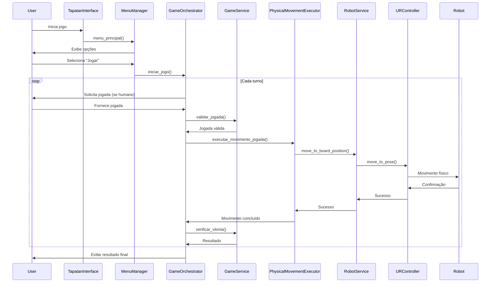
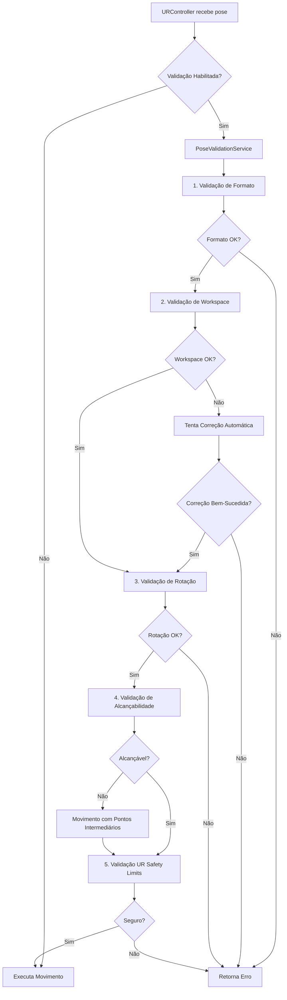
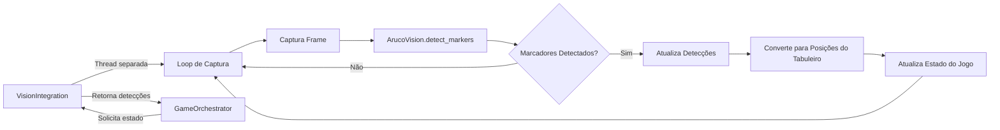

# 📐 Arquitetura do Sistema Tapatan Robótico

**Última Atualização:** 2025-10-27
**Versão:** 2.0 (Pós-Refatoração)

---

## 📋 Índice

1. [Visão Geral](#visão-geral)
2. [Princípios Arquiteturais](#princípios-arquiteturais)
3. [Estrutura de Camadas](#estrutura-de-camadas)
4. [Componentes Principais](#componentes-principais)
5. [Fluxo de Dados](#fluxo-de-dados)
6. [Interfaces e Contratos](#interfaces-e-contratos)
7. [Decisões Arquiteturais (ADRs)](#decisões-arquiteturais-adrs)
8. [Estrutura de Diretórios](#estrutura-de-diretórios)

---

## 🎯 Visão Geral

O Sistema Tapatan Robótico é uma aplicação para jogar o jogo Tapatan (variante filipina de Tic-Tac-Toe) usando:
- **Robô UR (Universal Robots)**: Manipulação física das peças
- **Visão Computacional (ArUco)**: Detecção dinâmica do tabuleiro
- **IA de Jogo (Minimax)**: Decisões inteligentes de jogadas

### Objetivos do Sistema

- ✅ Permitir jogo humano vs robô
- ✅ Suportar dois modos: com/sem visão computacional
- ✅ Garantir segurança através de múltiplas camadas de validação
- ✅ Manter código testável, modular e manutenível

---

## 🏛️ Princípios Arquiteturais

### 1. **Single Responsibility Principle (SRP)**
Cada classe tem uma única responsabilidade bem definida.

**Exemplo:**
- `GameDisplay` → Apenas visualização
- `PoseValidationService` → Apenas validação de poses
- `RobotDiagnostics` → Apenas diagnósticos e estatísticas

### 2. **Separation of Concerns**
Separação clara entre diferentes aspectos do sistema:
- UI separada da lógica de negócio
- Controle de robô separado da lógica de jogo
- Validação centralizada em serviço próprio

### 3. **Dependency Inversion (via Interfaces)**
Componentes dependem de abstrações, não de implementações concretas.

**Exemplo:**
```python
# Não: Depende de implementação concreta
class GameOrchestrator:
    def __init__(self):
        self.robot = URController()  # Acoplamento forte

# Sim: Depende de interface
class GameOrchestrator:
    def __init__(self, robot: IRobotController):
        self.robot = robot  # Acoplamento fraco
```

### 4. **Don't Repeat Yourself (DRY)**
Código duplicado foi eliminado através de:
- Serviços centralizados (validação, coordenadas, diagnósticos)
- Delegação clara entre componentes
- Componentes reutilizáveis

### 5. **Facade Pattern**
Interfaces simplificadas para subsistemas complexos:
- `RobotService` → Facade para controle de robô
- `MenuManager` → Facade para sistema de menus
- `VisionIntegration` → Facade para sistema de visão

---

## 🏗️ Estrutura de Camadas

```
┌─────────────────────────────────────────────────────┐
│              Presentation Layer                     │
│  Interação com usuário, menus, visualização         │
│  • main.py (coordenação)                            │
│  • ui/ (GameDisplay, MenuManager)                   │
└─────────────────────────────────────────────────────┘
                        ↓
┌─────────────────────────────────────────────────────┐
│            Application/Service Layer                │
│  Lógica de aplicação, orquestração, facades         │
│  • services/ (RobotService, GameOrchestrator)       │
│  • integration/ (VisionIntegration)                 │
└─────────────────────────────────────────────────────┘
                        ↓
┌─────────────────────────────────────────────────────┐
│               Domain Layer                          │
│  Regras de negócio, entidades, contratos            │
│  • interfaces/ (IRobotController, IGameService)     │
│  • services/ (BoardCoordinateSystem, Validation)    │
│  • tapatan_logic/ (Lógica do jogo Tapatan)          │
└─────────────────────────────────────────────────────┘
                        ↓
┌─────────────────────────────────────────────────────┐
│           Infrastructure Layer                      │
│  Implementações técnicas, hardware, drivers         │
│  • logic_control/ (URController)                    │
│  • vision/ (ArucoVision, CameraManager)             │
│  • config/ (Configurações)                          │
│  • diagnostics/ (Monitoramento, estatísticas)       │
└─────────────────────────────────────────────────────┘
```

---

## 🧩 Componentes Principais

### 📱 Presentation Layer

#### `main.py` - TapatanInterface
**Responsabilidade:** Coordenação geral do sistema

**Componentes Gerenciados:**
- `GameDisplay` - Visualização do tabuleiro e informações
- `MenuManager` - Sistema de menus e ações
- `VisionIntegration` - Sistema de visão (se disponível)
- `GameOrchestrator` - Orquestração do jogo

**Padrão:** Coordinator/Facade

#### `ui/GameDisplay`
**Responsabilidade:** Toda visualização e captura de input do usuário

**Métodos Principais:**
- `mostrar_banner()` - Banner do jogo
- `mostrar_tabuleiro()` - Visualização do estado do tabuleiro
- `obter_jogada_humano()` - Captura input do jogador
- `mostrar_info_jogo()` - Informações do estado atual

#### `ui/MenuManager`
**Responsabilidade:** Gerenciamento de menus e ações do sistema

**Métodos Principais:**
- `menu_principal()` - Menu principal
- `calibrar_sistema()` - Calibração do robô
- `testar_sistema_visao()` - Teste de visão
- `mostrar_status_completo()` - Status do sistema
- `parada_emergencia()` - Parada de emergência

---

### 🎮 Application Layer

#### `services/GameOrchestrator` - TapatanOrchestrator
**Responsabilidade:** Orquestração do fluxo do jogo

**Componentes:**
- `GameService` - Lógica do jogo Tapatan
- `RobotService` - Controle do robô
- `PhysicalMovementExecutor` - Execução de movimentos físicos
- `BoardCoordinateSystem` - Coordenadas do tabuleiro

**Fluxo Principal:**
1. Recebe jogada (humano ou IA)
2. Valida jogada com GameService
3. Executa movimento físico via PhysicalMovementExecutor
4. Verifica vitória/empate

#### `services/PhysicalMovementExecutor`
**Responsabilidade:** Execução de todos os movimentos físicos do robô

**Métodos Principais:**
- `executar_movimento_jogada()` - Executa jogada completa
- `executar_colocacao()` - Coloca peça no tabuleiro
- `executar_movimento_peca()` - Move peça de origem para destino
- `executar_movimento_simples()` - Movimento simples (calibração)

**Padrão:** Command Pattern

#### `services/RobotService`
**Responsabilidade:** Facade para controle completo do robô

**Interfaces Implementadas:** `IGameService`

**Componentes:**
- `URController` - Controlador UR específico
- `RobotDiagnostics` - Diagnósticos e estatísticas
- Configuração e gerenciamento de estado

**Métodos de Interface:**
- `initialize()` / `shutdown()`
- `move_to_board_position()`
- `place_piece()` / `move_piece()`
- `return_to_home()`

#### `integration/VisionIntegration`
**Responsabilidade:** Integração completa do sistema de visão

**Funcionalidades:**
- Inicialização e gerenciamento da câmera
- Thread de detecção contínua de marcadores ArUco
- Conversão de coordenadas pixel → tabuleiro
- Calibração automática e manual
- Sincronização com estado do jogo

---

### 🎲 Domain Layer

#### `interfaces/robot_interfaces.py`
**Responsabilidade:** Contratos e abstrações do sistema

**Interfaces Definidas:**

1. **`IRobotController`** - Controlador de robô
   - `connect()`, `disconnect()`, `is_connected()`
   - `move_to_pose()`, `get_current_pose()`
   - `emergency_stop()`, `stop_movement()`

2. **`IRobotValidator`** - Validação de poses
   - `validate_pose()`, `validate_coordinates()`
   - `check_reachability()`, `check_safety_limits()`

3. **`IGameService`** - Serviço de jogo
   - `initialize()`, `shutdown()`, `get_status()`
   - `move_to_board_position()`, `place_piece()`, `move_piece()`

4. **`IBoardCoordinateSystem`** - Sistema de coordenadas
   - `get_pose_for_position()`, `set_pose_for_position()`
   - `calibrate_board()`, `save/load_calibration()`

5. **`IDiagnostics`** - Diagnósticos
   - `register_movement()`, `register_validation()`
   - `get_movement_statistics()`, `generate_safety_report()`

6. **`IVisionSystem`** - Sistema de visão
   - `initialize()`, `capture_frame()`, `detect_markers()`
   - `calibrate()`, `get_board_positions()`

#### `services/BoardCoordinateSystem`
**Responsabilidade:** Gerenciamento completo do sistema de coordenadas do tabuleiro

**Funcionalidades:**
- Mapeamento posição lógica (0-8) ↔ pose física do robô
- Validação de posições
- Persistência de calibração
- Integração com visão ArUco
- Geração de coordenadas de calibração

**Arquivo de Calibração:** `board_calibration.json`

#### `services/PoseValidationService`
**Responsabilidade:** Validação multi-camadas de poses do robô

**Interfaces Implementadas:** `IRobotValidator`

**Camadas de Validação:**
1. **Formato** - Verifica se pose tem 6 valores [x, y, z, rx, ry, rz]
2. **Workspace** - Verifica limites cartesianos (x, y, z)
3. **Rotação** - Verifica limites angulares (rx, ry, rz)
4. **Alcançabilidade** - Verifica distância máxima de movimento
5. **Segurança UR** - Verifica limites de segurança do robô usando `isPoseWithinSafetyLimits()`

**Resultado:** `ValidationResult` com erros, warnings e detalhes

#### `tapatan_logic/GameService`
**Responsabilidade:** Lógica completa do jogo Tapatan

**Funcionalidades:**
- Gerenciamento do estado do tabuleiro
- Validação de jogadas
- Detecção de vitória/empate
- IA Minimax com poda alpha-beta
- Geração de coordenadas do tabuleiro

---

### ⚙️ Infrastructure Layer

#### `logic_control/URController`
**Responsabilidade:** Controle de baixo nível do robô UR

**Interfaces Implementadas:** `IRobotController`

**Componentes:**
- `RTDEControlInterface` - Comunicação RTDE (controle)
- `RTDEReceiveInterface` - Comunicação RTDE (leitura)
- `PoseValidationService` - Validação integrada
- `URDiagnostics` - Diagnósticos específicos do UR

**Funcionalidades:**
- Movimentos seguros com pontos intermediários
- Correção automática de poses inválidas
- Validação de segurança em múltiplas camadas
- Sistema de tentativas com fallback
- Benchmarks e diagnósticos

#### `diagnostics/RobotDiagnostics`
**Responsabilidade:** Diagnósticos e estatísticas gerais do robô

**Interfaces Implementadas:** `IDiagnostics`

**Funcionalidades:**
- Registro de histórico de movimentos
- Estatísticas de validações
- Relatórios de segurança
- Análise de benchmarks
- Exportação de dados para análise

#### `diagnostics/URDiagnostics`
**Responsabilidade:** Diagnósticos específicos do robô UR

**Funcionalidades:**
- Diagnóstico de rejeição de poses (identifica causa exata)
- Benchmark do sistema de correção automática
- Debug de sequências de movimento
- Funções utilitárias (elevar pose, mover para centro)

#### `vision/ArucoVision`
**Responsabilidade:** Detecção de marcadores ArUco e processamento de visão

**Funcionalidades:**
- Detecção de marcadores ArUco com IDs específicos
- Calibração de câmera
- Conversão pixel → coordenadas reais
- Detecção de peças no tabuleiro

#### `vision/CameraManager`
**Responsabilidade:** Gerenciamento de múltiplas câmeras

**Funcionalidades:**
- Auto-detecção de câmeras disponíveis
- Seleção de câmera preferida
- Gerenciamento de recursos
- Ajuste de parâmetros (resolução, FPS)

---

## 🔄 Fluxo de Dados

### Fluxo Principal do Jogo



### Fluxo de Validação de Poses



### Fluxo com Visão Computacional



---

## 🔌 Interfaces e Contratos

### Hierarquia de Implementações

```
IRobotController
    └── URController (logic_control/)

IRobotValidator
    └── PoseValidationService (services/)

IGameService
    └── RobotService (services/)

IBoardCoordinateSystem
    └── BoardCoordinateSystem (services/)

IDiagnostics
    ├── RobotDiagnostics (diagnostics/)
    └── URDiagnostics (diagnostics/)

IVisionSystem
    └── ArucoVision (vision/)
```

### Benefícios das Interfaces

1. **Testabilidade**: Fácil criar mocks para testes
   ```python
   class MockRobotController(IRobotController):
       def move_to_pose(self, pose, ...):
           return True  # Simula movimento
   ```

2. **Flexibilidade**: Trocar implementações sem mudar código cliente
   ```python
   # Produção: Robô real
   robot = URController(config)

   # Testes: Robô simulado
   robot = MockRobotController()

   # Ambos funcionam com mesmo código
   orchestrator = GameOrchestrator(robot)
   ```

3. **Documentação**: Interfaces servem como contratos claros
4. **Type Safety**: IDEs e type checkers podem verificar uso correto

---

## 📝 Decisões Arquiteturais (ADRs)

### ADR-001: Separação de Validação de Poses

**Data:** 2025-10-23
**Status:** ✅ Implementado

**Contexto:**
- Validação de poses estava duplicada em 3 locais diferentes
- Cada local tinha implementação ligeiramente diferente
- Difícil manter consistência e adicionar novas validações

**Decisão:**
Criar `PoseValidationService` único e centralizado com 5 camadas de validação.

**Consequências:**
- ✅ **Positivo**: Código centralizado e consistente
- ✅ **Positivo**: Fácil adicionar novas validações
- ✅ **Positivo**: Validação detalhada com `ValidationResult`
- ⚠️ **Neutro**: Adiciona mais uma dependência ao URController

**Implementação:**
- Arquivo: `services/pose_validation_service.py` (379 linhas)
- Interface: `IRobotValidator`
- Usado por: `URController`, `RobotService`

---

### ADR-002: Unificação do Sistema de Coordenadas

**Data:** 2025-10-23
**Status:** ✅ Implementado

**Contexto:**
- Coordenadas do tabuleiro estavam em 3 locais diferentes
- `gerar_tabuleiro_tapatan()` duplicada
- Calibração não persistia entre execuções
- Sem integração com visão ArUco

**Decisão:**
Criar `BoardCoordinateSystem` único com persistência e integração de visão.

**Consequências:**
- ✅ **Positivo**: Fonte única de verdade para coordenadas
- ✅ **Positivo**: Calibração persiste em arquivo JSON
- ✅ **Positivo**: Integração com visão ArUco
- ✅ **Positivo**: Validação de posições
- ⚠️ **Neutro**: `utils/tapatan_board.py` marcado como DEPRECATED

**Implementação:**
- Arquivo: `services/board_coordinate_system.py` (458 linhas)
- Interface: `IBoardCoordinateSystem`
- Calibração: `board_calibration.json`

---

### ADR-003: Separação de Responsabilidades em TapatanInterface

**Data:** 2025-10-23
**Status:** ✅ Implementado

**Contexto:**
- `main.py` tinha 677 linhas com 7+ responsabilidades diferentes
- Violação massiva do SRP
- Difícil testar e manter
- Misturava UI, menus, visão, coordenação

**Decisão:**
Dividir em 4 componentes especializados:
1. `GameDisplay` - Visualização
2. `MenuManager` - Menus e ações
3. `VisionIntegration` - Sistema de visão
4. `TapatanInterface` - Coordenação apenas

**Consequências:**
- ✅ **Positivo**: Redução de 43% em main.py (677 → 386 linhas)
- ✅ **Positivo**: Cada componente testável isoladamente
- ✅ **Positivo**: SRP respeitado
- ✅ **Positivo**: Código mais legível
- ⚠️ **Neutro**: Mais arquivos para navegar

**Implementação:**
- Arquivos criados: `ui/game_display.py` (263 linhas), `ui/menu_manager.py` (253 linhas), `integration/vision_integration.py` (260 linhas)
- Total novo código: +791 linhas bem estruturadas

---

### ADR-004: Extração de PhysicalMovementExecutor

**Data:** 2025-10-23
**Status:** ✅ Implementado

**Contexto:**
- `GameOrchestrator` misturava orquestração de jogo com execução física de movimentos
- Violação do SRP
- Dificulta testes do orquestrador sem robô real

**Decisão:**
Criar `PhysicalMovementExecutor` dedicado à execução de movimentos físicos.

**Consequências:**
- ✅ **Positivo**: GameOrchestrator mais focado (520 → 448 linhas, -14%)
- ✅ **Positivo**: Lógica de movimento física isolada e testável
- ✅ **Positivo**: Command pattern para movimentos
- ✅ **Positivo**: Fácil mockar para testes

**Implementação:**
- Arquivo: `services/physical_movement_executor.py` (279 linhas)
- Padrão: Command Pattern

---

### ADR-005: Criação de Sistema de Diagnósticos

**Data:** 2025-10-23
**Status:** ✅ Implementado

**Contexto:**
- `RobotService` tinha 1125 linhas com diagnósticos misturados
- `URController` tinha 791 linhas com muitos métodos de debug
- Diagnósticos espalhados dificultam análise centralizada

**Decisão:**
Criar dois serviços de diagnósticos:
1. `RobotDiagnostics` - Diagnósticos gerais
2. `URDiagnostics` - Diagnósticos específicos do UR

**Consequências:**
- ✅ **Positivo**: RobotService reduzido 17.5% (1125 → 928 linhas)
- ✅ **Positivo**: URController reduzido 21% (791 → 626 linhas)
- ✅ **Positivo**: Análise e estatísticas centralizadas
- ✅ **Positivo**: Exportação de dados para análise offline
- ✅ **Positivo**: Fácil adicionar novos diagnósticos

**Implementação:**
- Arquivos: `diagnostics/robot_diagnostics.py` (372 linhas), `diagnostics/ur_diagnostics.py` (286 linhas)
- Interface: `IDiagnostics`

---

### ADR-006: Introdução de Interfaces (Contratos)

**Data:** 2025-10-27
**Status:** ✅ Implementado

**Contexto:**
- Sistema sem contratos claros entre componentes
- Acoplamento forte dificultava testes
- Impossível trocar implementações
- Sem documentação formal de APIs

**Decisão:**
Criar 6 interfaces principais usando ABC (Abstract Base Classes) do Python:
- `IRobotController`, `IRobotValidator`, `IGameService`
- `IBoardCoordinateSystem`, `IDiagnostics`, `IVisionSystem`

**Consequências:**
- ✅ **Positivo**: Contratos claros e documentados
- ✅ **Positivo**: Testável com mocks
- ✅ **Positivo**: Type hints melhorados
- ✅ **Positivo**: Fácil criar implementações alternativas (simulador, etc.)
- ✅ **Positivo**: IDEs oferecem melhor autocomplete
- ⚠️ **Neutro**: +247 linhas de código wrapper nos implementadores

**Implementação:**
- Arquivo: `interfaces/robot_interfaces.py` (493 linhas)
- Classes atualizadas: URController, PoseValidationService, RobotService, RobotDiagnostics
- Script de teste: `test_interfaces.py`

---

## 📁 Estrutura de Diretórios

```
robotics_project/
├── main.py                          # Ponto de entrada principal
├── ARCHITECTURE.md                  # Este documento
├── REFACTORING_PLAN.md             # Plano de refatoração
├── board_calibration.json          # Calibração do tabuleiro
│
├── config/                         # Configurações
│   └── config_completa.py          # Configuração completa do sistema
│
├── interfaces/                     # Contratos e abstrações
│   ├── __init__.py
│   └── robot_interfaces.py         # 6 interfaces principais
│
├── ui/                             # Camada de apresentação
│   ├── __init__.py
│   ├── game_display.py             # Visualização e input
│   └── menu_manager.py             # Gerenciamento de menus
│
├── integration/                    # Integração de sistemas
│   ├── __init__.py
│   └── vision_integration.py       # Integração visão completa
│
├── services/                       # Camada de aplicação
│   ├── board_coordinate_system.py  # Sistema de coordenadas
│   ├── pose_validation_service.py  # Validação de poses
│   ├── physical_movement_executor.py  # Execução de movimentos
│   ├── robot_service.py            # Facade de robô
│   └── game_orchestrator.py        # Orquestração do jogo
│
├── tapatan_logic/                  # Lógica de domínio do jogo
│   └── game_service.py             # Regras do Tapatan
│
├── logic_control/                  # Infraestrutura - Controle
│   └── ur_controller.py            # Controlador UR específico
│
├── vision/                         # Infraestrutura - Visão
│   ├── aruco_vision.py             # Detecção ArUco
│   └── camera_manager.py           # Gerenciamento de câmeras
│
├── diagnostics/                    # Diagnósticos
│   ├── __init__.py
│   ├── robot_diagnostics.py        # Diagnósticos gerais
│   └── ur_diagnostics.py           # Diagnósticos UR específicos
│
├── utils/                          # Utilitários
│   └── tapatan_board.py            # [DEPRECATED]
│
└── tests/                          # Testes (futuro)
    ├── unit/
    ├── integration/
    └── fixtures/
```

---

## 🎯 Próximos Passos

### Fase 4 - Em Progresso

- [x] **4.1** - Criar interfaces/protocolos ✅
- [ ] **4.2** - Implementar Dependency Injection
- [ ] **4.3** - Criar testes unitários (>70% cobertura)
- [x] **4.4** - Documentar arquitetura ✅

### Melhorias Futuras

1. **Testes**: Atingir >70% de cobertura de testes
2. **CI/CD**: Configurar pipeline de integração contínua
3. **Logging**: Sistema de logging mais robusto
4. **Métricas**: Dashboard de métricas em tempo real
5. **Simulador**: Criar simulador de robô para testes offline

---

## 📚 Referências

### Padrões de Design Utilizados

- **Facade Pattern**: RobotService, MenuManager
- **Command Pattern**: PhysicalMovementExecutor
- **Strategy Pattern**: Diferentes estratégias de movimento
- **Observer Pattern**: Sistema de visão com thread separada
- **Singleton Pattern**: Configurações globais

### Princípios SOLID Aplicados

- **S**ingle Responsibility: Cada classe tem uma responsabilidade
- **O**pen/Closed: Extensível via interfaces
- **L**iskov Substitution: Implementações substituíveis via interfaces
- **I**nterface Segregation: Interfaces específicas e pequenas
- **D**ependency Inversion: Dependências via abstrações

### Documentação Externa

- [ur_rtde Documentation](https://sdurobotics.gitlab.io/ur_rtde/)
- [OpenCV ArUco](https://docs.opencv.org/4.x/d5/dae/tutorial_aruco_detection.html)
- [Python ABC](https://docs.python.org/3/library/abc.html)

---

**Fim do Documento de Arquitetura**
